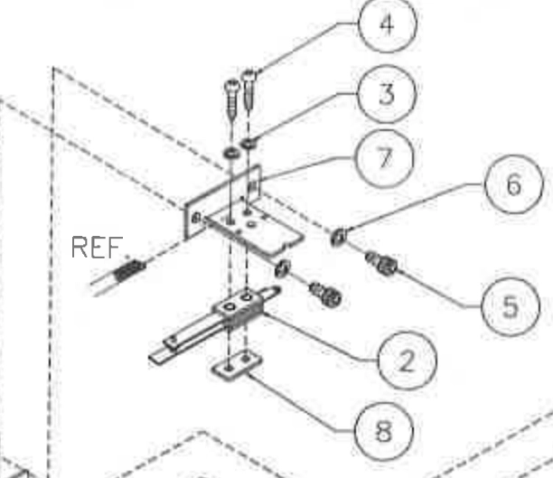
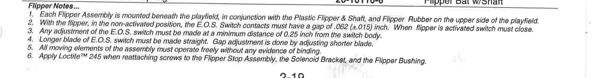

# Lower flipper EOS construction

Source: Bally service manual PDF page 93, printed 2-19, A-15849-R-4 Flipper
Assembly. Its item 2 is SW-1A-194, Switch Assembly. The retained native drawing
crop shows the parallel contact blades and mounting stack at that callout.
Switch Locations printed 2-50 maps F1/F3 to SW-1A-194; the corresponding left
assembly on PDF page 92, printed 2-18, lists the same switch assembly. The exact
parts subtrees at items 437 and 484 independently retain both contact blades.

The complete six Flipper Notes are paraphrased faithfully here; this is a factual
transcription, not a claim of emulator EOS feedback measurement:

1. The assembly mounts beneath the playfield, with the plastic flipper, shaft and rubber above it.
2. At rest, the EOS contacts have a 0.062 inch gap, with a tolerance of ±0.015 inch; activation must close the switch.
3. Make EOS adjustment at least 0.25 inch from the switch body.
4. Keep the longer EOS blade straight and adjust the gap with the shorter blade.
5. All moving parts must move freely without binding.
6. Apply Loctite 245 when reinstalling the screws for the flipper stop assembly, solenoid bracket and flipper bushing.

The longer/shorter blade instruction and depicted paired blades establish leaf
construction for lower physical EOS 111/113. PinMAME's generated EOS state does
not independently establish the physical contact type or polarity.

